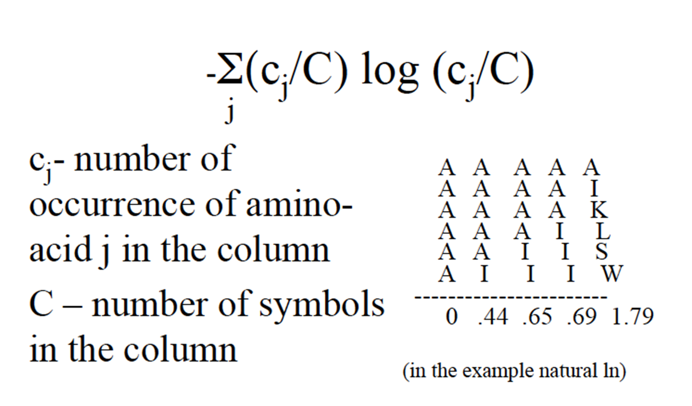
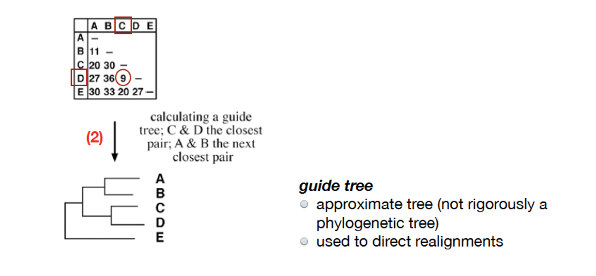
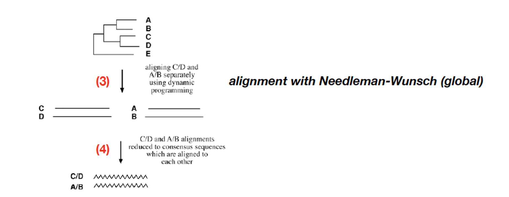

# Lecture 7
# Multiple sequence alignment

### Problem
Align more then two seq in such a way that max numberof residues from each seq are matches

Align all coloumns and sequences!, reconstruct the best multiple seq alignment

Example. sq1,sq2,s3

maybe sq1 and sq2 are good but sq3 maybe dont fit so well

## How do we solve this?

### Sum of pairs scores

**We use the subsitution/scoring matrix**

Match = 1
Mismatch = -1
Gap = -2
Gap/Gap = 0

**Sum of pairs scores**

 A  A  T   - 

 A  A  C   - 

 A  A  C   T 

3  3  1  -4 = **+1**

OR

 A  A  -  T 

 A  A  C  - 

 A  C  C  T 

 3  3  -3 -3 = **0** 

### Entropy score

**Measure degree of randomness in each of the coloumns**

Count how many seq the alignments agree

 1  2  3   4 

 A  A  T   - 

 A  A  C   - 

 A  A  C   T 

- Col 1:
1*log(1) = 0

- Col 2:
1*log(1) = 0

- Col 3: 

 We see T once, while C two times 

    T ------------------ C          

(1/3log(1/3)) - (2/3log(2/3))

- Col 4: 

 (1/3log(1/3)) - (2/3log(2/3)) 

### Dynamic programming

  - A A C 

 -0-2 -4-8 

 A-2 0 

 A-4 

 T-8 

But in 3d!

Every cell in the cube represents one coloum in the 3d cube

When we rate a score, look at all directions, X/Y/Z

If its 3d cube, comes from 7 directions

(2^num_of_sequences) -1

Too many sequences -> way too impractical

Cannot do dynamic programming -> too many sequences and lengths

## Progressive alignments

 s1: AAT 

 s2: AAC 

 s3: AACT 

 Find the best score within the parise score matrix 

  

  

     S1 S2 S3 

     --------- 

 S1| -  1   1 

 S2| 1  -   1 

 S3| 1   1  - 

  

 Find most similar pair: AAC- / AACT 

  

 Next find next seq, and align the next seeuqnece to that  

Most similar: seq1/seq 2

 AAC- 

 ACCT 

add seq 3

 AAT- 

 or 

 AA-T  

 OR add seq 4 (AAGCT) 

 we added a gap because of G in eq 4 

AA-C-
AA-CT

 Lock yourself in at the start 

### Distance score, lower is better

 Find seq two with lowest distance score ex: (C and D) 

 Align them, and add next sequence 

 But youre locked in, so if you see a wrongdoing, may be smart to: 

Make a sort of tree 

So make sure we get a pretty good one, early.

Do pairwise alignment of the ones with lowest distance, then try to merge them

Align CD and AB sep. using dynamic programming

then reduce CD and AB alignments to consensus sequences to be aligned

If in a col, sequences agree, you can shift around

But if you pair stuff wrong

S1 A G

S2 A C

S3 C G

S4 C -

First row is easy since you can move them, but What about the second coloumn??

Score AA to CC

Score how to go from GC to G- ?

We can say that R = A or G

(wiki)["https://en.wikipedia.org/wiki/FASTA_format#Sequence_representation]

so we use this:

S1 A G 
        
S2 A C 

= A S

S3 C G

S4 C -

= C [G/C]

So do alignment on

**A S**

**C [G/C]**

Now do pairwise alignment and score them, into a new consuenus sequence

And keep going to align with all other sequences

This is called the **CLASTAWL** Method

### What can go wrong

Depnds on inital pairwise alignment

Gaps introduced early are kept. 

