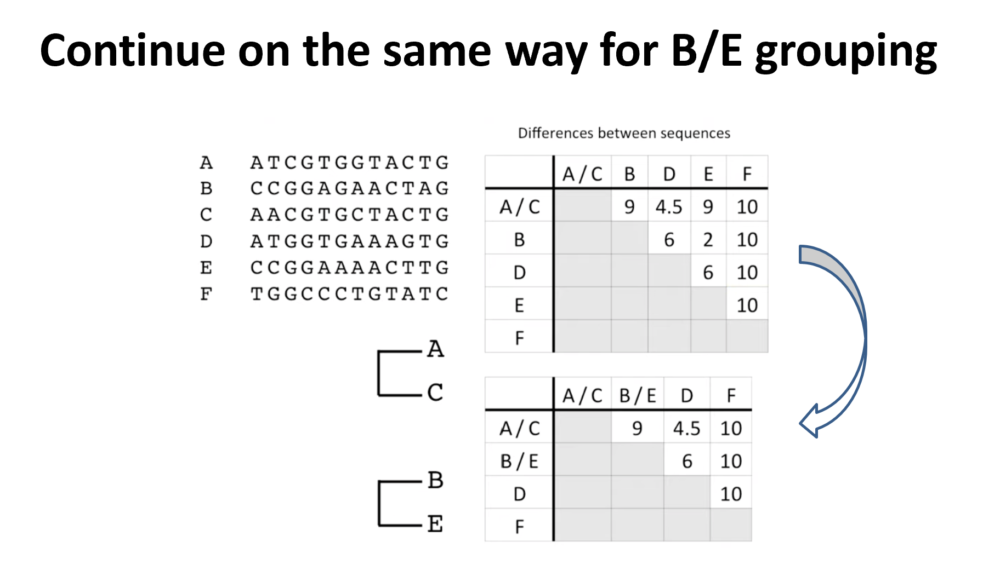

### Lecture 7

Phylogenetics

Evolution is a thing and is cool

common anscestor yea yea good blabla

### Assume

Each postion in seq. evolve indp.

**Outgroup**

Compare sequences,
ex: human,mouse,lemur

kangaroo is outgroup, so we just say kangaroo branched out early or first

Aaaa so the root has to be somewhere on the kangaroo line

**Midpoint rooting**

Put the root somewhere on the longest line

These two give different answers, different approaches

### Molecular clock

Num of mutations observed is prop. to time

See evolutionary distance by num of mutations

MSL is tthe first and most critical tree construction step

### Lets try it!

We build a cool matrix to tell us the issues

Find pairs most similar, **AC** and **BE**

Merge A and C

Now we have them merged, do difference between AC and all other sequences

But how to fill in for A/C

Use the average from both A and C, 

Ex:

A --> D is 4

C --> D is 5

4+5 / 2 = 4.5

A/C --> is 4.5

Now merge B/E since they have the lowest diff

Now find lowest wich is A/C and D, so merge these

Now lowest is between A/C/D and B/E, so merge these

Two nodes left, link them

So F will connect to root node 

