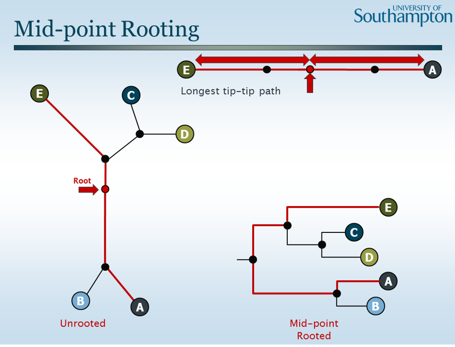

### Lecture 7

Phylogenetics

Evolution is a thing and is cool

common anscestor yea yea good blabla

### Assume

Each postion in seq. evolve indp.

**Outgroup**

Compare sequences,
ex: human,mouse,lemur

kangaroo is outgroup, so we just say kangaroo branched out early or first

Aaaa so the root has to be somewhere on the kangaroo line

**Midpoint rooting**

Put the root somewhere on the longest line

These two give different answers, different approaches

### Molecular clock

Num of mutations observed is prop. to time

See evolutionary distance by num of mutations

MSL is tthe first and most critical tree construction step

### Lets try it! ITS CALLED UPGMA !!!

We build a cool matrix to tell us the issues

Find pairs most similar, **AC** and **BE**

Merge A and C

Now we have them merged, do difference between AC and all other sequences

But how to fill in for A/C

Use the average from both A and C, 

Ex:

A --> D is 4

C --> D is 5

4+5 / 2 = 4.5

A/C --> is 4.5

Now merge B/E since they have the lowest diff

Now find lowest wich is A/C and D, so merge these

Now lowest is between A/C/D and B/E, so merge these

Two nodes left, link them

So F will connect to root node 

### Evolution models, what distances matters?

**Jukes-cantor**

all nucletodie subs. are same chance

**Kimura model**

Transversions  (A -> C) are less commen that transtions (A-> G)

ACG

GCG

TCG

### Chacrhter-based models

Make trees directly from sequences, dont make pairwise

Trace evolution of specific elements

Different trees for each column in the tree for each gene seperelty.

Computatinally very expensive!!!

**Maximum parsimony** -> 

searches for the trees with least num of evolutnary steps to explain the differences.

Non-informative stuff is thrown away

Tree with smallest number of changes, is thrown away

We dotn care about examples which only happens in one species, since this is just private

if a change is observed twice (in two diff. species) now we talking

Count min num of susbtiations 

AAGG, two sub

TTCC, two sub

ACAC, two sub

----------

count how many mutations needed to end up with AAGG (from GGGG)

It is **1**, or you can say it is **2**

1: H C G O

2: H G C O

**Maximum likelihood** 

In what case does simulation data look like real model?

To calculate probabilites

Statisictial model to really back it up

### Tree validation

If we change stuff a little, do we get the same tree?

Or do small changes swap up the tree completely

Mess up the data a bit, random stuff -> same tree?

Out of 1000 trees that have been messed with a little, how many times do i see the tree i made? If its 990 its good

**Bootstrapp'n**

Random data set, same sides, duplication

*Example:*

10 informative sides

Create 10 new informative sites by sampling 10 with replacement

Ex sample: 1,2,1,3,2,5,6 .. etc

Make the tree again even with the duplicates

Do the process a bunch, see if most trees are as expected

**Jackknifi'n**

Randomly sample groups to make trees

*Example:*

Randomly split data into 2,3,4, n groups

Group1: (1,3,10,9,7)

Group2: (2,4,5,6,8)

Make trees for each group, are the trees similar to your goal tree?

### There are a bunch of tools for this stuff.

they are cool check em out

