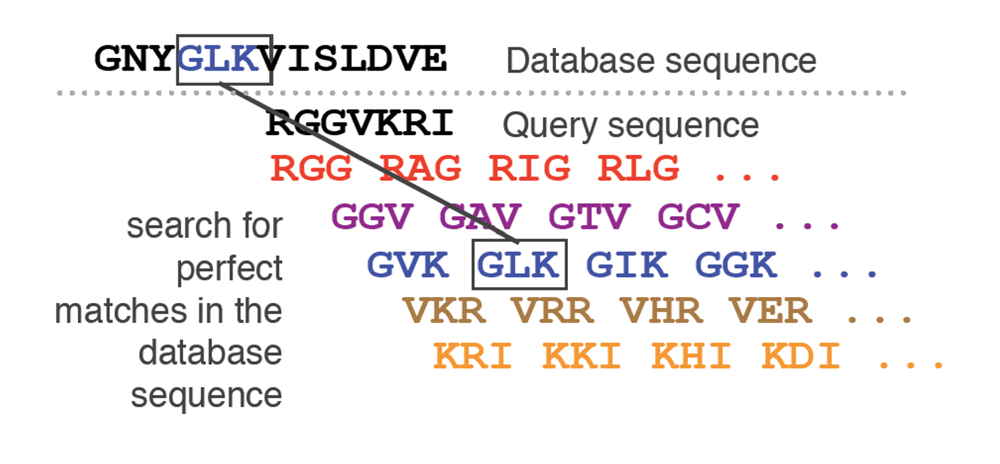
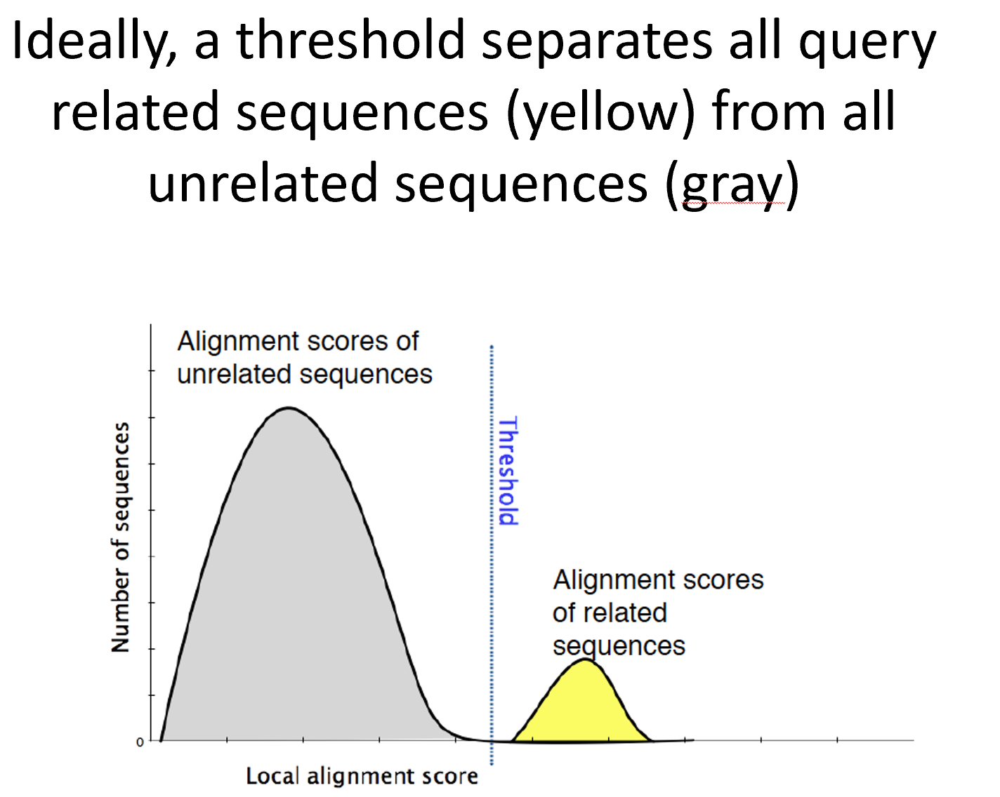
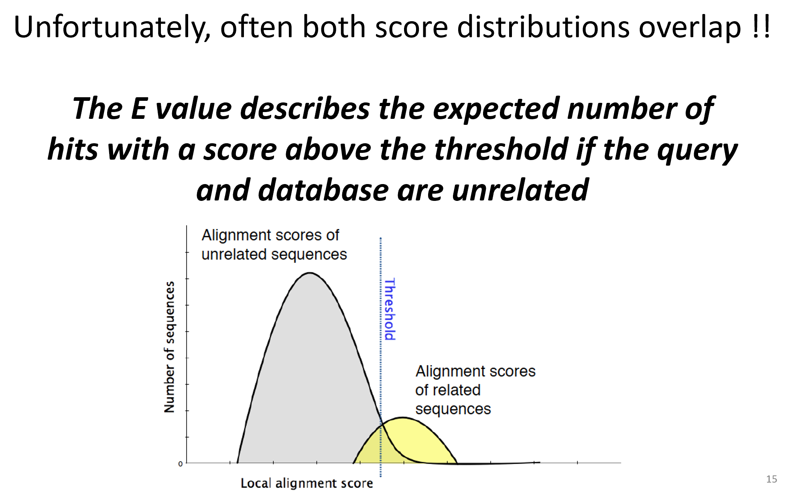

# Lecture 4

## 1 Biological databases
***we use db to find sequences***

given a query sequence, go to database and find matching or similar 

examples:
- nucleic acid research 
- genbank
- uniprot --> tells us important stuff about proteins

DB search is tricky

## 2 BLAST

Simplified SW - alignment fast and easy to access
Estimates only part of the search space
BLAST restricsts search by a quick inital scan, before doing more intense alignments
BLAST is not gauranteed!!

- algorithm
Make a list of query word pairs

Expand word pairs -> create similar words to the query words

DB is scanned to find seq entries that match compiled word list

# Algorithm

1. ## Setup grams

q: ACGTAC

2-grams: AC, CG, GT, TA , AC

similarity matrix alphabet:

  A   C   G   T
A 2  -2   1  -2
C     2  -2  1
G         2  -2
T            2

Match is 2 points, mismatch points varies 
some mismatch are worse

2. ## Score segment pairs and matching n-grams

N-gram Matching    Score
AC      AA          = 0
AC      AC          = 4
etc...

Good score = correct alignment

There is a threshold score, example 3

Then we only want the matching ones

N-gram   Match   Scores
AC     AC,AT,GC  4,3,3

Repeat for all N-grams

3. ## Create lookup table

N-gram-match  Indicies of Q    Score
AC                  1,5         4,4 
GC                  1,3,5       3,3,3

^This GC tells us that we can have a GC where our query has an AC, but it will only have 3, not 4
AC in index 1 is a max score of 4! Very good 

4. ## Scan DB, to find matching that reaches across threshold

AAAGTG

GT index 3, score 4
TG index 2,4 score 3,3

Potential GT match at index 3
Potential TG match at index 2 and 4

 AAAGTG
AAATGG
  AAATGG

5. ## We are going to have a lot of possible matches! --> 

If we already have an identical hit then yippi

else,

find similar regions and prioritize regions with matches which are close genetically, increase their score, 
and decrease score of regions with less matches

If regions match close, extend matching regions slightly

Go left and right to add positive alignment!

D P P Q G L F
D P **P E** G V V

Score -2 **7 7 2 6 1** -1

Score good when a little to left or right
But too far out, negative scores

## Phase 4 of blast:

Initial db hits are extended in both directions using dynamic programming
# TODO: UNDERSTAND THIS

Example:

query: AAAT
db:

fill in score matrix
# TODO: UNDERSTAND THIS

**Too much right or down, more gaps (we dont care about gaps)**

So cut off slightly right and down (n-steps) 

We dont gotta fill in the enitre matrix

## BLAST sequence alignment explained simply
- make n-grams of query string (usually 2)
- exploit matches
- expand clusters of matches to add to score
- do local alignment, with limitations
- give answers and provide a confidence level

### When we add a new sequence?

We also add its n-grams

CTGA is added
then 
1. CT
2. TG

is also stored, so that you dont need to process these things a million times
the indexes will always be the same

so we bascially go right to step 3

# Statistics

**E-value is the expected numbers of hits, as good or better than observed, if db and query is random**

Blast will never say it didnt find anything!

Compare the found score to a random sequence's score

In an ideal world, related sequences and unrelated sequences have a vastly different alignments score

Example:
*Real seq*
Len 10
a:2
c:3
t:1
g:4

Now make a random seq with the same length and same number of a,c,t,g
Then align it and show the align. score

Hopefully the random seq. lines up as the graph shown above, and does not match.

That means the E value should be 0, for the REAL query
E value increases as you tend towards random sequences.

*E value is how many hits with this kind of score "score meaning align. score"*

And if sequence is more random, lower score, higher chance of other random seq reaching random score

E value depends on a lot of factors, there is a formula for it. 

***but....***

Score may be kind mixed hehe, sometimes a query is actually decently likely to be a random seq!

**Example**
very short sequences can result in real alignments being hard to tell from random

## Alignment matrix

given scoring matrix, what is the score, but we have different hits

Max indent describes sequences that are not quite the same length, even if the score is just as good

**S**
Different alignment matrixes??? due to different lengths in sequences
scores can be scaled 
graph can be approximated

**K**
*remember...!* If DB has more sequences, more chance of a random hit! 

Different DB sizes will widen or shorten chance to find alignment only by chance

If DB size = infinite, then any sequence is likely to find an alignment

BLAST takes this into account by producing BIT scores and E values

### Max score

example max score = 677 
if db with 2^677 entries
then ???

but max score doesnt depend on the specific query, just query size, not proteins specfically

can be compared across several DB sequences

### Blast

Blast just knows without computing ??? cool

