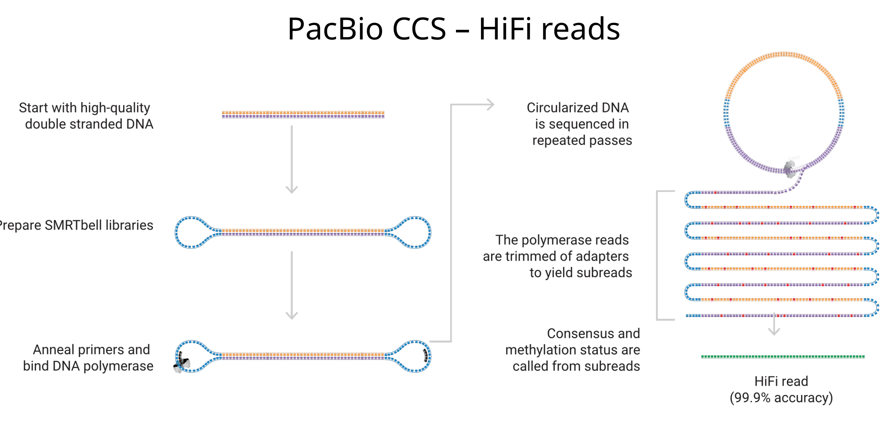

# Lecture 6

**Assignment 1 due 15th september!**

## Background

infection by trypanosomes parasites (transmitted by flies to humans)

They live extra-cellularly, exposed to the immune system, but still stay hidden from the immune system

Untreated -> death

Targets a lot of cattle (20million cattle infected, 60million at risk)

### How to evade the immune system in the bloodstream?

Parasite is covered in VSG (variant surface glycoprotein) 

Immune system only sees surface level n-term of VSG's

*T. brucei* genome has more than 1000 **DIFFERENT** VGS genes!

C term is the same but the N-term sticking out is different, so the part the immune system sees,
varies constantly

VGS proteins are constanly recycled, remade etc
proteins that have been bound to an antibody are more likely to be recycled, and replaced with another VGS

### VGS expression over time

varies greatly

parasite population expresses one VGS, with a few with different VGS

immune system catches and kills main VGS, but the different VGS can repopulate

loops over and over in waves

### Mosaic VG's

Create new VGS's from existing ones, variant genes

Quickly we go from 1000 VGS's to a lot more

### Mice experiment

Get rna in blood from mice after 3,5,10,12 days (different mice groups)

uses **PCR** 
1. add dNTP's, Primers and polymerase (primers recognize sequence of interest)
2. denature (temperature)
3. anneal (primers only bind to rna we want)
4. extend (polymerase builds off the primer)    
5. repeat 2-4 until happy with amount of copies

### Short read vs long read RNA-seq

short : 20-100bp 
- re-assemble (useless for this)

long : 10kbp (10000 bp)
-entire dna/rna

VSG dna is 1400-200bp

### CCS
CCS = Circular consensus sequence

put loops of dna on the end of the DNA

anneal primers and bind dna polymerase

keeps going around and around, making copies of the dna

when it goes around, 10% of dna may be wrong (it made a mistake)
mistakes vary... but low chance to make same mistakes many times
so after many copies, "vote" on the most common

